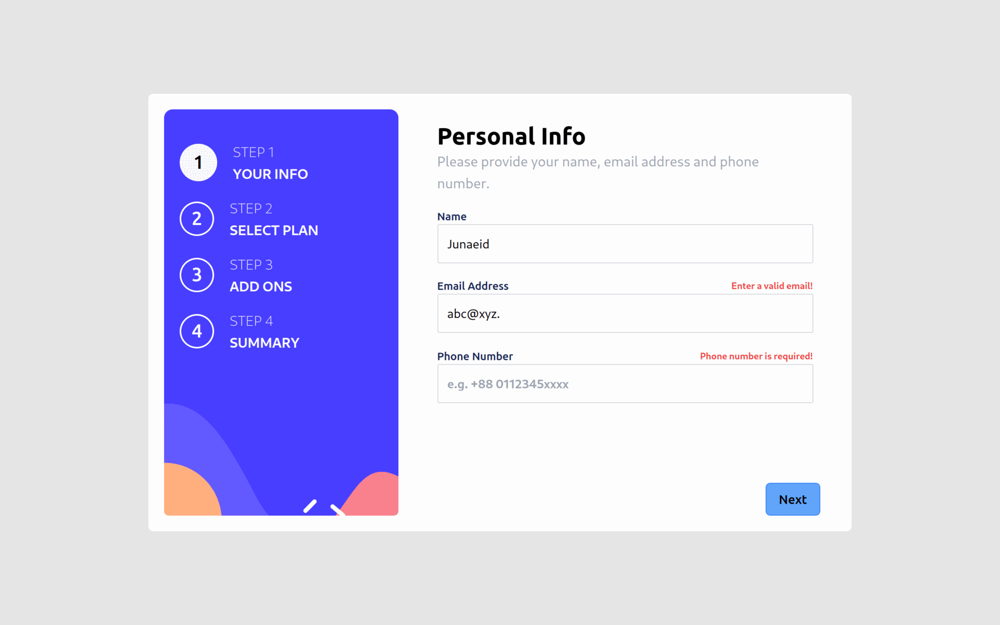
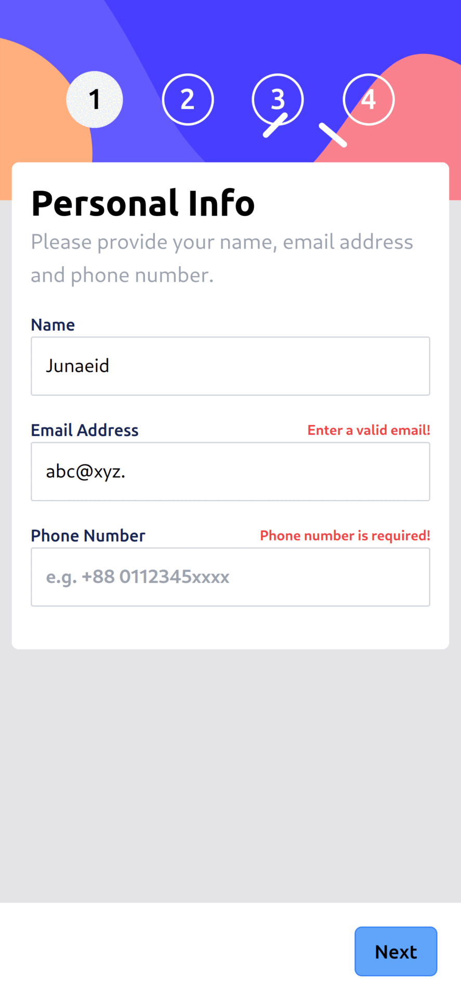

# Frontend Mentor - Multi-step form solution

This is a solution to the [Multi-step form challenge on Frontend Mentor](https://www.frontendmentor.io/challenges/multistep-form-YVAnSdqQBJ). Frontend Mentor challenges help you improve your coding skills by building realistic projects. 

## Table of contents

- [Frontend Mentor - Multi-step form solution](#frontend-mentor---multi-step-form-solution)
  - [Table of contents](#table-of-contents)
  - [Overview](#overview)
    - [The challenge](#the-challenge)
    - [Screenshot](#screenshot)
    - [Links](#links)
  - [My process](#my-process)
    - [Built with](#built-with)
  - [Author](#author)

## Overview

### The challenge

Users should be able to:

- Complete each step of the sequence
- Go back to a previous step to update their selections
- See a summary of their selections on the final step and confirm their order
- View the optimal layout for the interface depending on their device's screen size
- See hover and focus states for all interactive elements on the page
- Receive form validation messages if:
  - A field has been missed
  - The email address is not formatted correctly
  - A step is submitted, but no selection has been made

### Screenshot

**Desktop View**

**Mobile View**

### Links

- Solution URL: [View on Frontend Mentor](https://www.frontendmentor.io/solutions/fully-functional-multistep-form-with-react-and-tailwind-css-ExvpX55loE)
- Live Site URL: [View live on vercel](https://multi-step-form-navy-five.vercel.app/)

## My process

### Built with

- Semantic HTML5 markup.
- Tailwind CSS.
- Mobile-first workflow.
- [React](https://reactjs.org/) - JS library

## Author

- Frontend Mentor - [@devjuaneid](https://www.frontendmentor.io/profile/devjunaeid)
- Twitter - [@junaeiddd](https://www.twitter.com/junaeiddd)
- Linkedin - [juaneid](www.linkedin.com/in/junaeid)